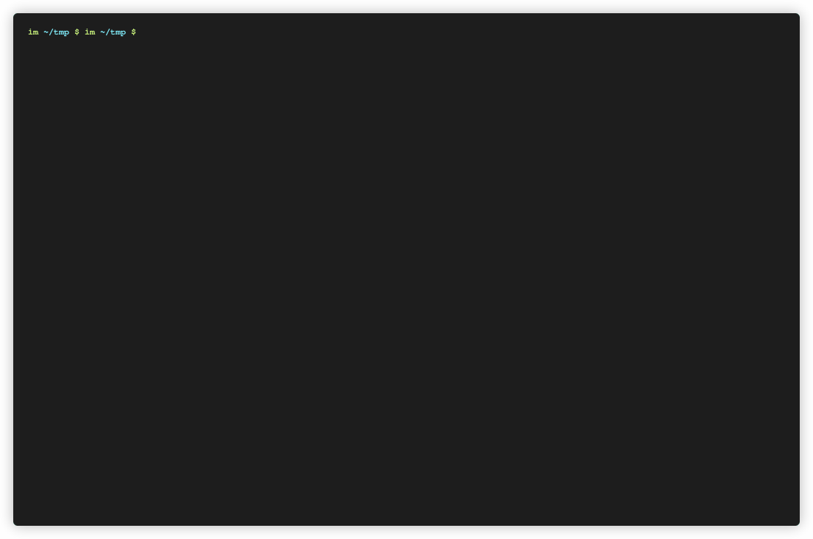

# Pico CLI/Shell

Pico CLI/Shell is a size-optimized, minimalistic command-line interface (CLI) designed for embedded systems. **It uses less than 500 bytes of code and less than 100 bytes of RAM.**

## Key Features 

- Written in C (c99)
- Small and efficient code base
- Supports a help command
- Supports multiple instances
- Simple way to add user commands
- Released under the BSD license

**Size:**

| Text | Data |
|------|------|
| 451  | 68   |

Compiled with GCC 13.2 using -Os optimization for Cortex-M4 target.

## Constraints

Our primary goal with this implementation was to create a compact yet useful CLI/shell interface. Therefore, Pico CLI/Shell doesn't support some common features like autocompletion, argument parsing, history. Nonetheless, user commands can prompt for user input, offering an alternative to command arguments. See the 'Usage' section for more details on this feature.

## Usage


### Compiling
The whole implementation is in one file `pico_cli.c`. Other than that there are 
two header files `pico_cli.h` and `pico_cli_internal.h`.

There are a few defines that user can alter before compilation:
* CLI_COMMAND_BUFF_SIZE defines max size of the cli command name,
  default size is 32bytes
* PICO_CLI_USE_STATIC_MEMORY_ALLOCATION Use static memory allocation

### Initialization

#### Using Dynamic Memory Allocation

Initialize the CLI by providing your own memory allocation
function. Why and how you should use runtime memory allocation in
embeede system is described [here](https://github.com/IzidorM/fw_memory_allocator)

```c
#include <stdint.h>
#include "pico_cli.h"

// Define memory size for the data as power of 2
static uint8_t mem[8];

struct pico_cli *example_pico_cli_init_with_dynamic_memory_allocation(void)
{
    struct pico_cli_settings cs = {
        .my_malloc = my_malloc,
        .get_char = my_get_char,
        .send_char = my_send_char,
        .input_end_char = '\r',
        .prompt = "guest> ",
    };

    return pico_cli_init(&cs);
}
```

#### Using Static Memory Allocation

If compiled with PICO_CLI_USE_STATIC_MEMORY_ALLOCATION defined.

```c
#include <stdint.h>
#include "pico_cli.h"

static struct pico_cli cli;

void example_pico_cli_init_with_static_memory_allocation(void)
{
    struct pico_cli_settings cs = {
        .my_malloc = my_malloc,
        .get_char = my_get_char,
        .send_char = my_send_char,
        .input_end_char = '\r',
        .prompt = "guest> ",
    };

    pico_cli_init_internal(&cli, &cs);
}
```

### Running

Call the `pico_cli_run` function periodically in a super loop or task in case OS is used.

### Defining and Adding Commands

Define commands and add them to the CLI interface:

```c
#include "pico_cli.h"

// simple command to reboot our sysem
static void reboot_cli(struct pico_cli *cli, char *s)
{
    (void)cli;
    (void)s;

    NVIC_SystemReset();
}

static struct pico_cli_cmd reboot = {
    .next = NULL,
    .command_name = "reboot",
    .command_description = "Rebooting the CPU\n",
    .command_function = reboot_cli,
};


// example of a command using pico_cli_get_user_input() function
// to get user input when needed. This can be used instead of command
// arguments...
static void quiz_cli(struct pico_cli *cli, char *s)
{
        (void) cli;
        (void) s;

	char *quiz[3][2] = {
	{"What is the capital of France?", "Paris"},
	{"What is the largest planet in our solar system?","Jupiter"},
	{"What is the chemical symbol for water?","H2O"}
	};

	dmsg("Start of a smal quiz\n");		
	uint32_t i = 0;
	for (i = 0; 3 > i; i++)
	{
		dmsg("Question: %s\n", quiz[i][0]);
		dmsg("Input an answer: ");
		char *input = pico_cli_get_user_input(cli);
		if (0 == strcmp(quiz[i][1], input))
		{
			dmsg("Correct\n");
		}
		else
		{
			dmsg("Wrong, sorry try again :(\n");
			break;
		}
	}

	dmsg("You manage to answer %i questions right\n", i);
}

static struct pico_cli_cmd quiz = {
        .next = NULL, // It will be set to point to next command automaticaly
        .command_name = "quiz",
        .command_description = "short quiz\n",
        .command_function = quiz_cli,
};


void app_cli_commands_add(struct pico_cli *cli)
{
	pico_cli_add_cmd(cli, &reboot);
	pico_cli_add_cmd(cli, &quiz);

}

```

## Unit Tests

Unit tests are available in the `unit_test` folder. Before running them, update the path to Unity in the Makefile. The tests should execute smoothly on any Linux system with GCC installed.
